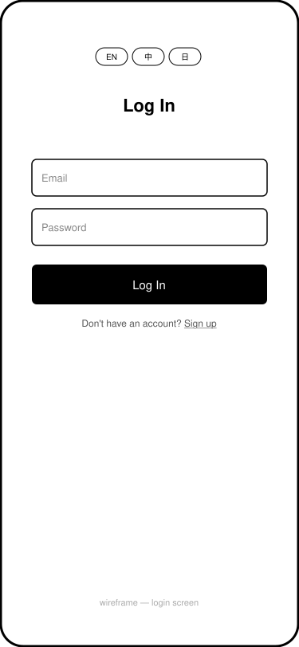
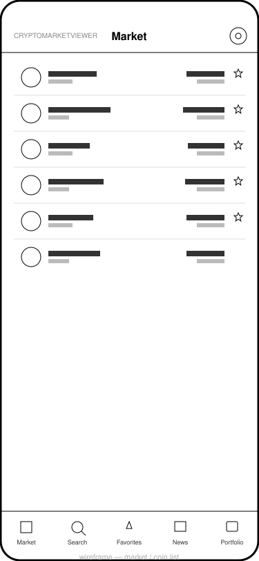
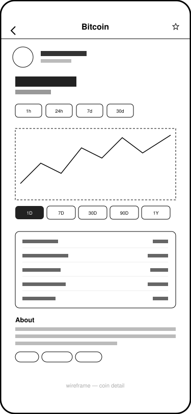

# CryptoMarketViewer — Project Report

CM3050 Mobile Development, Final Project

## Expo Snack Link and Test Account

Expo Snack:

**https://snack.expo.dev/@wzhe/cryptomarketviewer?platform=ios**

A test account is already registered and ready to use:

- Email: `tester@example.com`
- Password: `123456!`

## Concept Development

CryptoMarketViewer is a mobile app for browsing live cryptocurrency prices, researching individual coins, tracking a personal portfolio, saving favorites, and reading crypto news — built with Expo and React Native.

The brief for this module asked for a mobile application that demonstrates genuine mobile-specific competency rather than a CRUD app that happens to run on a phone. That framing shaped the concept from the start. Cryptocurrency data was chosen as the domain for three practical reasons: a free, well-documented public API (CoinMarketCap) was available for live market data; the domain naturally produces a rich set of screens (list, detail, search, portfolio) without needing invented content; and it gave a reason to implement things that are awkward or pointless on desktop but natural on mobile — pull-to-refresh, infinite scroll, a device-native settings screen, and (later) a system-following dark mode.

The feature set was not fixed upfront as a full specification. It grew in deliberate stages, each one shipped and working before the next began:

1. Authentication and a market list with live prices (the minimum needed to have something real to look at)
2. Favorites, backed by a real database with row-level security rather than local-only state
3. A news feed
4. Search across the full coin universe
5. A price history chart and portfolio tracking
6. Multi-language support (English/Chinese/Japanese) with currency following language
7. Light/dark/system appearance

This staged approach was a deliberate choice: at every point the app was a complete, runnable product, not a half-built shell. That mattered because it meant testing and evaluation happened continuously throughout the project rather than being bolted on at the end.

## Wireframing

Wireframing for this project was kept light: a small set of basic sketches for the core screens (Login, the Market/coin list, and Coin Detail), rather than a full set covering every screen in the app. They are plain boxes and lines with no colour or styling, just enough to show roughly where things sit.

Starting with only a little upfront sketching is a reasonable way to work on a small, solo project built with Expo. The round-trip from changing a layout to seeing it running on a real simulator takes under two seconds, which for a project this size is often faster than drawing a screen out first and then rebuilding the same layout in code.

| Login | Market / coin list | Coin detail |
|---|---|---|
|  |  |  |

## User Feedback

There was no external user testing — no classmates, tutors, or forum reviewers were involved in shaping specific decisions during development. The feedback loop was self-directed: after implementing each feature, the app was run on an iOS simulator (and, at several points, a physical-device-equivalent via Expo Go through Expo Snack) and used the way an actual user would use it — searching for a real coin, adding several favorites across multiple lists, adding a portfolio holding and checking the value updates, switching language and watching currency and every screen's text change, switching appearance and checking every screen in both light and dark mode.

## Prototyping

The first working prototype (committed 2026-08-08) was deliberately minimal: email/password authentication via Supabase, and a market list screen pulling live data from CoinMarketCap. It had no favorites, no search, no portfolio — the goal was to prove the full vertical slice (auth → API call → rendered list) worked end to end before anything else was built on top of it.

Favorites were added next, initially as a single flat list per user. That model was replaced within two days by a many-to-many "multiple named lists" model (`favorite_lists` + `favorite_list_coins`, with a Postgres trigger capping each list at 100 coins) once it became clear a single list didn't match how people actually organize things they're tracking — "long-term holds" and "watching" are different categories. This is the clearest example in the project of prototyping doing its job: the cheap-to-build version surfaced a real limitation before a more complex, harder-to-change version was built on the wrong foundation.

Search, the price chart, and portfolio tracking followed the same pattern of prototype-then-refine: each was built against the live API first, and the specific quirks of that API (undocumented pagination limits, a `quotes/historical` endpoint that doesn't return OHLC candles on this pricing tier, a coin-map endpoint that costs zero API credits and can be cached indefinitely) were discovered and designed around empirically, by calling the real endpoints, rather than assumed from documentation.

## Development

The app was built one function at a time. Each function was finished, tried out on a real simulator, and checked before the next one was started. Below is what was built, in the order it was built, in plain terms — including how each piece was tested along the way.

**Login and sign up.** The first thing built was a simple email/password login screen, using Supabase for authentication. Testing here meant creating real test accounts, logging in and out, and making sure a session stayed open after closing and reopening the app (Supabase saves the login securely on the device using `expo-secure-store`).

**Market list.** Next came the main screen: a scrolling list of coins with live prices, pulled from the CoinMarketCap API. This needed pull-to-refresh and "load more as you scroll" (infinite scroll), since the API only returns a page of coins at a time. Testing meant scrolling to the bottom repeatedly to check more coins kept loading, and pulling down to refresh to check prices actually updated.

**Coin detail page and price chart.** Tapping a coin opens a page with its full price history, drawn as a simple line chart, plus stats like market cap and supply. The chart was built by hand with `react-native-svg` rather than a charting library, since one line chart didn't need a whole extra package. Testing meant switching between the different time ranges (1 day, 7 days, 30 days, and so on) and checking the chart redrew correctly each time, and checking coins with very little price history didn't crash the chart.

**Favorites.** Users can star a coin to save it. This started as one simple saved list per user. After using it for a bit, it became clear people would want more than one list — for example "long-term holds" versus "watching". So the favorites feature was rebuilt to support several named lists per user, each stored in Supabase and limited to 100 coins per list. Testing here meant creating several lists, moving coins between them, renaming and deleting lists, and checking the 100-coin limit was actually enforced, not just shown in the app.

**Search.** A search screen was added to find any coin by name or symbol, with recent searches saved so they could be tapped again. Since typing triggers a search on every keystroke, this needed a short delay (debounce) before firing the actual request, otherwise the app would send far too many requests. Testing meant typing quickly, deleting text, and checking searches still returned the right coins without slowing the app down.

**Portfolio tracking.** Users can add coins they hold and see the total value update using live prices. Testing meant adding and removing holdings, changing the quantity, and checking the total value recalculated correctly.

**News feed.** A simple scrolling list of crypto news articles, each opening in the browser when tapped. Testing here was mostly checking that pagination worked properly, since the news API only allowed a small number of articles per request.

**Multiple languages.** The app supports English, Chinese, and Japanese, with the display currency automatically following the chosen language (English shows USD, Chinese shows CNY, and so on). Testing meant switching language on every single screen and checking all the text, numbers, and dates changed correctly, and checking prices were refetched in the new currency rather than just relabelled.

**Keeping API keys safe.** Partway through the project, the CoinMarketCap and news API keys were being shipped directly inside the app, which meant anyone could pull them out of the installed app and steal them. This was fixed by moving those two API calls behind a small Supabase server function, so the real keys never leave the server. Testing meant checking every screen that used those APIs (market list, search, coin detail, news) still worked exactly the same after the change, just without the keys being visible in the app.

**Light and dark mode.** A light/dark/system appearance setting was added, which meant checking every single screen for colors that were hardcoded and would break in dark mode. This touched close to twenty files. Testing meant going through every screen in both light mode and dark mode, side by side, to catch any text or icons that were invisible or badly readable — a few were only caught this way, since the app compiled and ran fine while still looking broken.

**Making it run in Expo Snack.** The last big task was getting the project to open and run inside Expo Snack (a tool for trying an Expo app in the browser without installing anything). This turned out to be broken for this type of project on Expo's side, not something wrong with this app specifically, which was proven by trying several other unrelated public projects and seeing the same failure. The fix was to publish the project to Snack using Expo's own publishing tool directly, instead of relying on the broken "import" feature. Testing meant actually opening the published Snack and clicking through the app on a simulated phone to make sure it really worked, not just that it uploaded without errors.

Automated unit tests were added toward the end of the project, once the core functions above were stable, and are described in full in the next section — but the day-to-day testing described above (running the app after every change and checking it by hand) happened continuously throughout development, not just at the end.

## Unit Testing

Besides testing the app by hand, automated tests were added using Jest, a common tool for testing JavaScript code, together with Expo's own testing setup (`jest-expo`). These tests run in seconds and can be re-run any time to check nothing was accidentally broken. They cover two kinds of things: plain functions, and a few screens' building blocks (components).

**Testing plain functions.** These are small pieces of code that take an input and return an output, with no screen involved, which makes them the easiest and fastest things to test. Tests were written for:

- The functions that format prices, percentages, and dates (for example, turning the number `63000.5` into `$63,000.50`), checked across different currencies and languages.
- The functions that talk to the CoinMarketCap API, especially the part that decides whether a response was an error or not. This turned out to be trickier than expected: some parts of the API send back the number `0` for "no error", while other parts send back the text `"0"` instead. A test was written specifically to check both cases were handled the same way, since getting this wrong would mean a real error from the API could be silently ignored.
- The function that checks whether a language code (like `"en"` or `"zh"`) is one the app actually supports.

**Testing components.** A component is a reusable piece of the screen, like a single row in a list or a button. Rather than test every component, three were picked to show a few different ways of testing:

- The price chart component was tested by giving it fake price data and checking it drew the line the right color depending on whether the price went up or down, and that it showed a "not enough data" message when there weren't enough points to draw.
- The theme picker (the Light/Dark/System switch in Settings) was tested with the real settings logic behind it, not a fake version, since checking that switch actually changes and saves the setting is the entire point of that component.
- The coin row (the row shown in the market list, search results, and favorites — the most-used piece of UI in the app) was tested on its own, with the parts it depends on (navigation, currency, the favorite star) replaced with simple stand-ins, so the test focuses only on whether the row shows the right name, price, and color for a positive or negative change.

Full screens were not covered by automated tests, since testing a whole screen would mean faking the database, navigation, and secure storage all at once — a much bigger task than testing on this smaller scale, and one that was left for future work rather than attempted here.

## Evaluation

Overall, the project reached its goal: a mobile app that feels like a real mobile app, not a website in a phone. It has live data, saved logins, offline-friendly navigation, and a proper dark mode.

Building one feature at a time and testing each one as it was built worked well. Problems got caught early, while they were still small and easy to fix, instead of piling up until the end.

